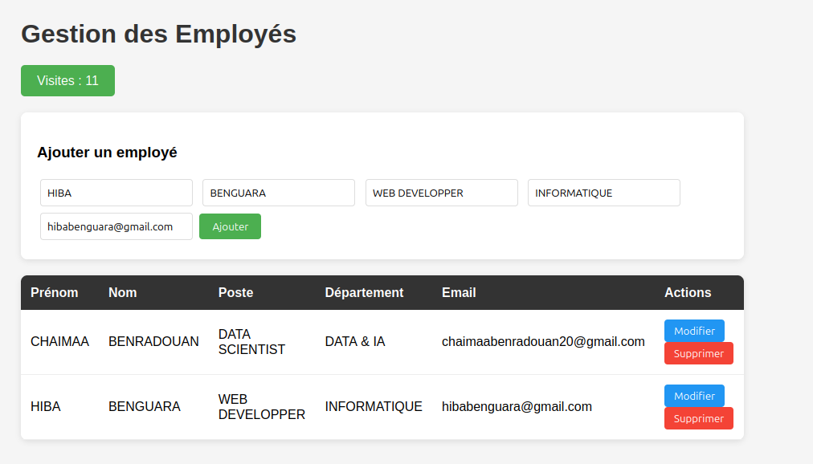
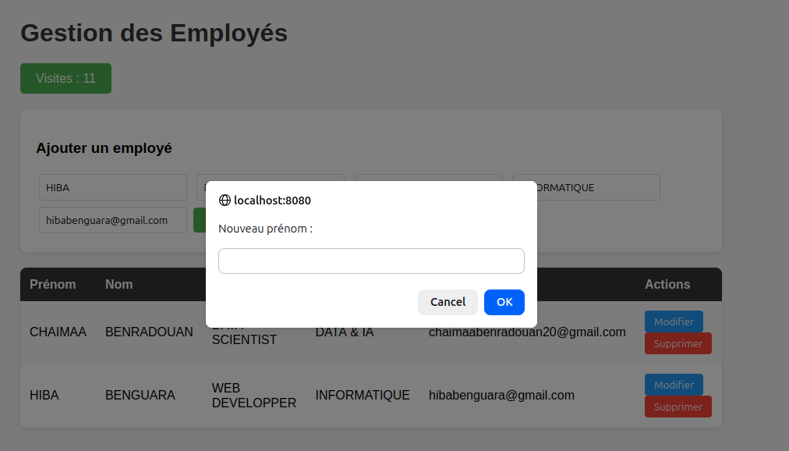
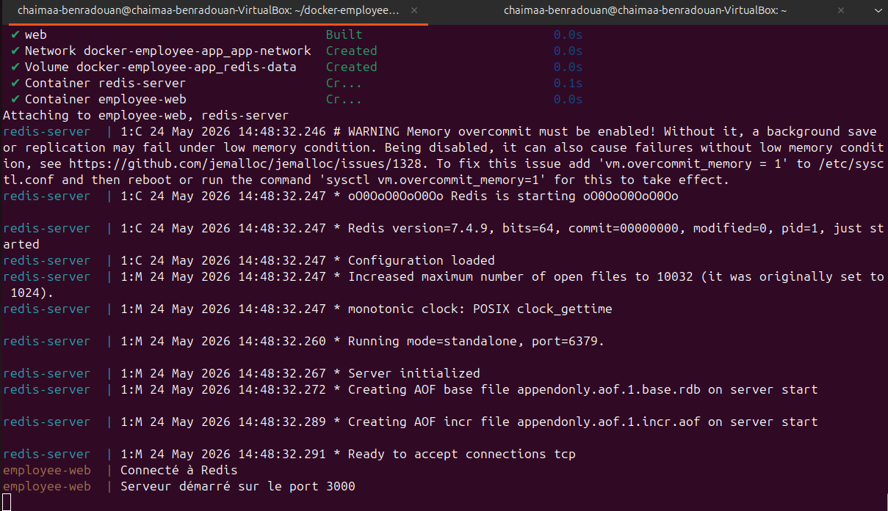
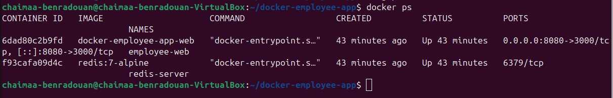

# 🐳 Déploiement d'une Architecture Multi-Conteneurs avec Docker

**Module : Systèmes d'Exploitation et Environnement de Développement**  
**Binôme : Chaimaa BENRADOUAN & Hiba BENGUARA**  
**1ère Année Cycle Ingénieur — Génie Informatique & Intelligence Artificielle**

---

## 🎯 Objectif

Déployer une application web dynamique de gestion des employés en utilisant Docker.  
L'application est composée de deux services communicants :

- Un serveur **Node.js + Express** (interface web + API REST)
- Une base de données **Redis** (stockage des employés + compteur de visites)

---

## 🏗️ Architecture

```
Navigateur → localhost:8080
                  ↓
     [Conteneur : employee-web]
       Node.js + Express (port 3000)
                  ↓ réseau Docker interne (app-network)
     [Conteneur : redis-server]
       Redis 7 (port 6379)
                  ↓
       [Volume : redis-data] (persistance)
```

| Service | Image | Port interne | Port hôte |
|---|---|---|---|
| web | node:18-alpine (build local) | 3000 | 8080 |
| redis-server | redis:7-alpine | 6379 | — |

---

## 📁 Structure du Projet

```
docker-employee-app/
├── server.js            # Application Express : page HTML + API CRUD + compteur Redis
├── package.json         # Dépendances Node.js (express, redis, uuid)
├── Dockerfile           # Recette de construction de l'image Node.js
├── docker-compose.yml   # Orchestration des 2 services
├── screenshots/         # Captures d'écran du projet
└── README.md            # Ce fichier
```

---

## 🛠️ Installation de l'Environnement (Ubuntu 24.04 — VirtualBox)

> Node.js et Redis ne sont **PAS** installés sur la VM. Docker s'en charge via les images.

### 1. Mise à jour du système
```bash
sudo apt update && sudo apt upgrade -y
```

### 2. Installation de Docker
```bash
sudo apt install -y docker.io
```

### 3. Installation de Docker Compose V2
```bash
sudo apt install -y docker-compose-v2
docker compose version
```

### 4. Utiliser Docker sans sudo
```bash
sudo usermod -aG docker $USER
newgrp docker
```

### 5. Vérification
```bash
docker run hello-world
# Résultat : Hello from Docker! ✅
```

### 6. Création du dossier projet
```bash
mkdir ~/docker-employee-app && cd ~/docker-employee-app
```

---

## 📄 Explication du Dockerfile

```dockerfile
FROM node:18-alpine       # Image légère (~50 Mo)
WORKDIR /app              # Répertoire de travail dans le conteneur
COPY package.json ./      # Copie des dépendances EN PREMIER (optimisation cache)
RUN npm install           # Installation des dépendances (layer mis en cache)
COPY server.js .          # Copie du code source APRÈS (évite de réinstaller npm)
EXPOSE 3000               # Port écouté par Express
CMD ["node", "server.js"] # Commande de démarrage
```

**Optimisation des layers :** En copiant `package.json` avant `server.js`, Docker met en cache
le layer `npm install`. Si on modifie uniquement le code, Docker réutilise ce cache
et le build est beaucoup plus rapide.

---

## 📄 Explication du docker-compose.yml

```yaml
version: '3.8'

networks:
  app-network:            # Réseau privé isolé entre les deux conteneurs
    driver: bridge

volumes:
  redis-data:             # Volume nommé pour la persistance des données Redis
    driver: local

services:

  redis-server:
    image: redis:7-alpine
    command: redis-server --appendonly yes  # Persistance AOF activée
    volumes:
      - redis-data:/data                    # Données sauvegardées sur disque

  web:
    build: .                                # Build depuis le Dockerfile local
    ports:
      - "8080:3000"                         # Port hôte 8080 → conteneur 3000
    depends_on:
      - redis-server                        # Redis démarre avant Node.js
```

---

## 🚀 Lancer le Projet

```bash
cd ~/docker-employee-app
sudo docker compose up --build
# → http://localhost:8080
```

---

## 🛑 Arrêter le Projet

```bash
# Arrêter (données conservées)
docker compose down

# Arrêter + supprimer les données Redis
docker compose down -v
```

---

## 🔧 Commandes Utiles

```bash
# Voir les conteneurs actifs
docker ps

# Voir les logs en temps réel
docker compose logs -f

# Vérifier le compteur dans Redis
docker exec -it redis-server redis-cli GET visits

# Entrer dans le conteneur Node.js
docker compose exec web sh
```

---

## ✨ Fonctionnalités de l'Application

- **Compteur de visites** : incrémenté à chaque requête sur `/` via `redisClient.incr('visits')`
- **Lister les employés** : `GET /api/employees`
- **Ajouter un employé** : `POST /api/employees`
- **Modifier un employé** : `PUT /api/employees/:id`
- **Supprimer un employé** : `DELETE /api/employees/:id`

---

## 📸 Captures d'Écran

### Interface principale


### Modification d'un employé


### Logs Docker — Serveur démarré


### Conteneurs actifs — docker ps


---

## 👩‍💻 Réalisé par

| Nom | Filière |
|---|---|
| **Chaimaa BENRADOUAN** | 1ère Année Cycle Ingénieur — Génie Informatique & IA |
| **Hiba BENGUARA** | 1ère Année Cycle Ingénieur — Génie Informatique & IA |

*Travail réalisé en binôme — Année universitaire 2025/2026*
